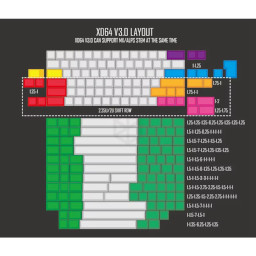

# XD60 v3 QMK Firmware flashing tutorial

XD64 XD60 3.0 Mechanical Keyboard Customization 60% PCB Support RGB Bottom Light ALPS MX Axis TypeC Keyboard Accessories



V3.0 Kit1: XD60 PCB board X1, GH60 satellite axis set
V3.0Kit3: XD60 PCB board X1, GH60 satellite axis set, G-axis 5-pin axis set (70 pieces, can be specified arbitrarily)
G-axis combination), telephone line Type-c
Note: 70 G-axes can be combined with any non silent axis.
Product Features:
1. Directional key layout design, supporting multiple splitting and combination layouts
2. Supports cherry MX axis and ALPS axis
3. Support splitting spaces
4. Support Type-C interface
5. Perfectly compatible with all standard GH60 configurations, and compatible with the 60 positioning plate of the original configuration
6. KLE can be used to customize key positions, supporting TKG-TOOLS offline flashing and TKG online flashing
7. Standard ICSP interface reservation, can support USB flash mode flashing through flashing chip
8. Perfectly compatible with 99% of GH60 casings on the market
9. Retained expansion ports compatible with REVB and REVQE
10. CAPAS multi light position design, allowing for free selection of caps key position light function
11. Space three light patch design and reserved multiple bottom light solder pads for people with hands-on ability to play.
12. Multiple types of light board expansion boards can be connected externally (external connection does not affect the appearance, but half height shells and ultra-thin acrylic shells cannot be used)
13. Native RGB bottom light~~
14. Switching between eight onboard lighting effects and jumper wires for external lighting boards
15. In the future, multiple expansion versions can be added to the expansion area to achieve various interesting functions

## [QMK Firmware](https://qmk.fm/)

Open-source keyboard firmware for Atmel AVR and Arm USB families

Install QMK build and flash tools:

```
curl -fsSL https://install.qmk.fm | sh
```

See QMK docs for help: [QMK Docs](https://docs.qmk.fm/)

To build firmware from keymap:
```
qmk compile -kb <keyboard> -km <keymap>
```

To blash firmware file to keyboarD:
```
qmk flash -kb <my_keyboard> -km <my_keymap>
```

## Compile HEX with QMK Docker

```
cd kbd;
docker pull qmkfm/qmk_cli;
docker run --rm -it -v qmk_firmware:/qmk_firmware qmkfm/qmk_cli qmk setup;
docker run --rm -it \
  -v qmk_firmware:/qmk_firmware \
  -v $(pwd):/host_keymaps \
  qmkfm/qmk_cli \
  /bin/bash -c "qmk compile /host_keymaps/xd60_v3_kb2.json && cp /qmk_firmware/.build/xiudi_xd60_rev3_xd60_v3_kb2.hex /host_keymaps/xd60_v3_kb2.hex"
```

## Flash HEX with dfu-programmer

Keyboard must be put to bootloader mode by pressing reset button on the back of the PCB.

Verify with lsbusb that you see Atmel DFU bootloader listed.
Notice Bus number and Device number, if needed by dfu-programmer.
```
lsusb
...
Bus 001 Device 031: ID 03eb:2ff4 Atmel Corp. atmega32u4 DFU bootloader
...
```
Not 
```
lsusb
...
Bus 001 Device 029: ID 7844:6363 XIUDI XD60rev3
...
```

Install dfu-programmer.
```
sudo apt install dfu-programmer;
```

```
sudo dfu-programmer atmega32u4 get
Bootloader Version: 0x00 (0)

sudo dfu-programmer atmega32u4:001:031 erase
sudo dfu-programmer atmega32u4 flash xd60_v3_kb2.hex 
sudo dfu-programmer atmega32u4 reset
```


## Flashing QMK Keyboard 1 (Nordic ISO, normal shifts, arrow keys on same row, MacOS)

Keymap file: [xd60_v3_kb1_nordic_iso_normal_shifts_arrow_keys_on_same_row_macos.json](xd60_v3_kb1_nordic_iso_normal_shifts_arrow_keys_on_same_Wrow_macos.json)

```
qmk compile -kb <keyboard> -km <keymap>;
qmk flash -kb <my_keyboard> -km <my_keymap>;
```

## Flashing QMK Keyboard 2 (Nordic ISO, small shifts, normal arrow keys, Linux/Win)

Keymap file: [xd60_v3_kb2_nordic_iso_small_shifts_normal_arrow_keys_linux_win.json](xd60_v3_kb2_nordic_iso_small_shifts_normal_arrow_keys_linux_win.json)

```
qmk compile -kb <keyboard> -km <keymap>;
qmk flash -kb <my_keyboard> -km <my_keymap>;
```